# prova-2023-09-29

# Criando instâncias EC2

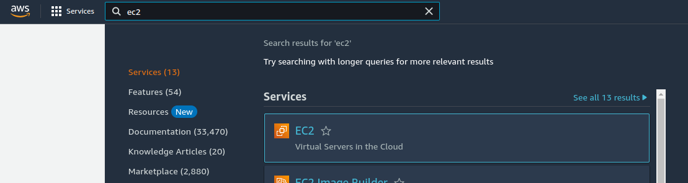
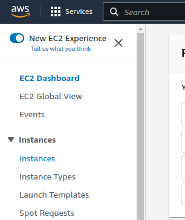

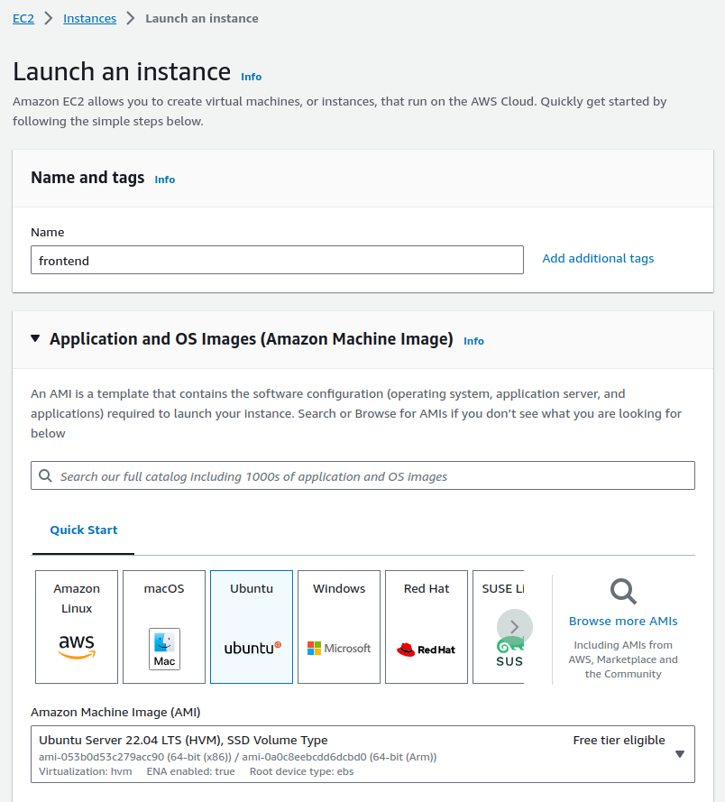
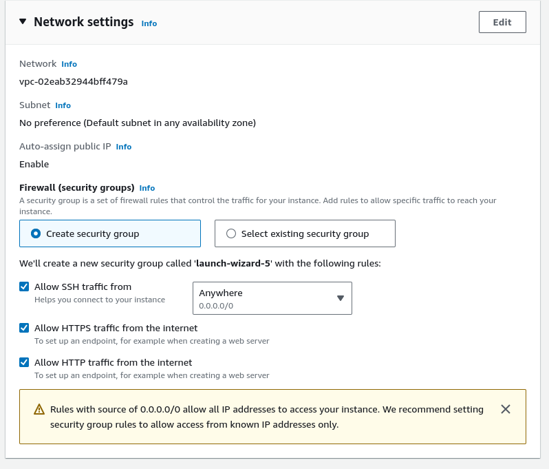
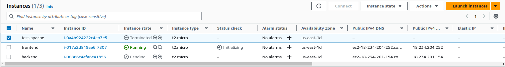

Entenda aqui a criação análoga do frontend e backend\

## Permissões da instância
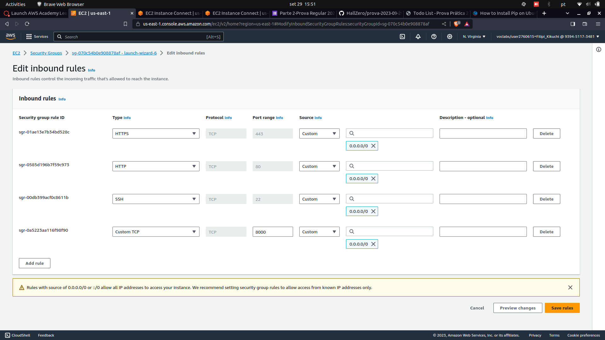

## Adicionando IP elástico à instância Backend


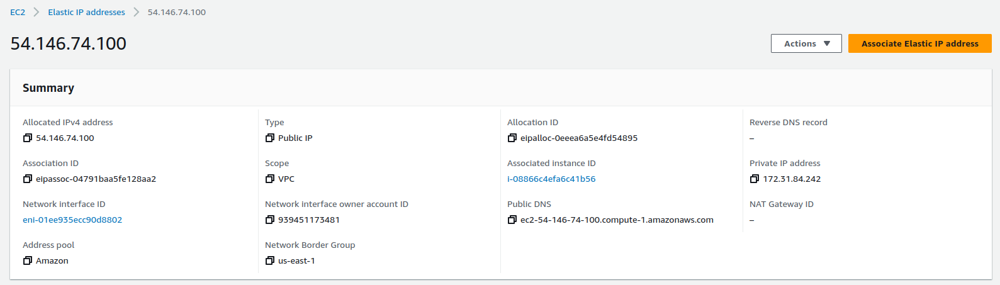
Note que o IP associado é o da instância backend!
# Criando uma instância RDS

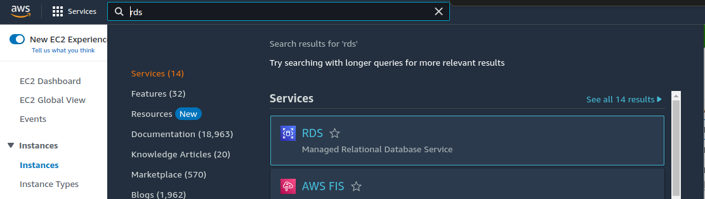
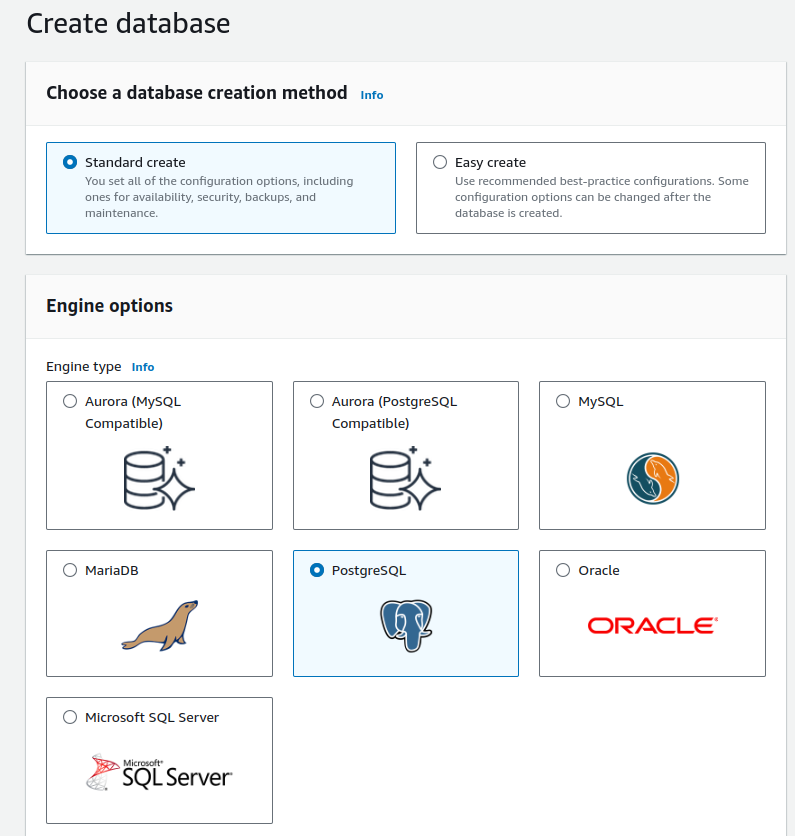
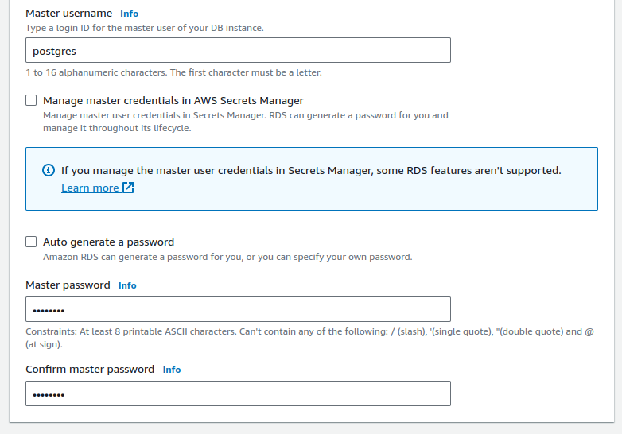
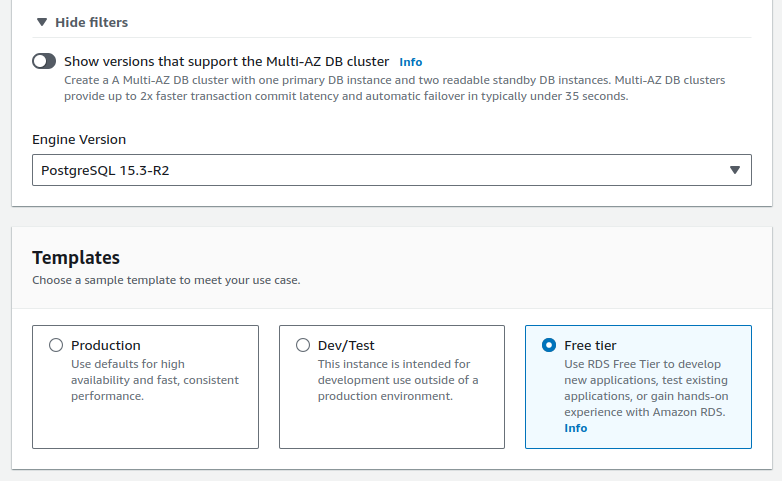
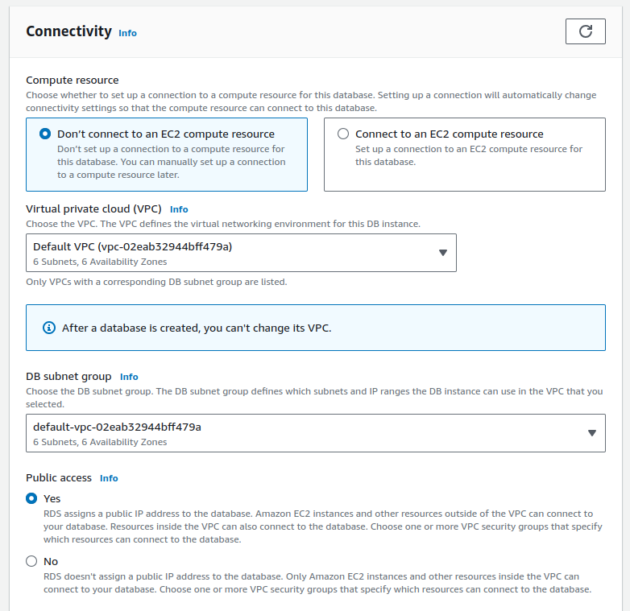
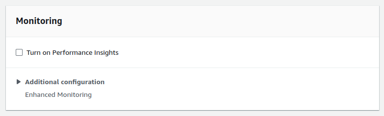

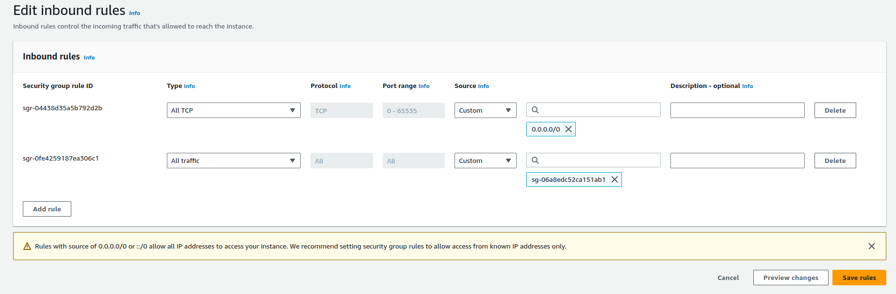

# Testando a comunicação utilizando DBeaver
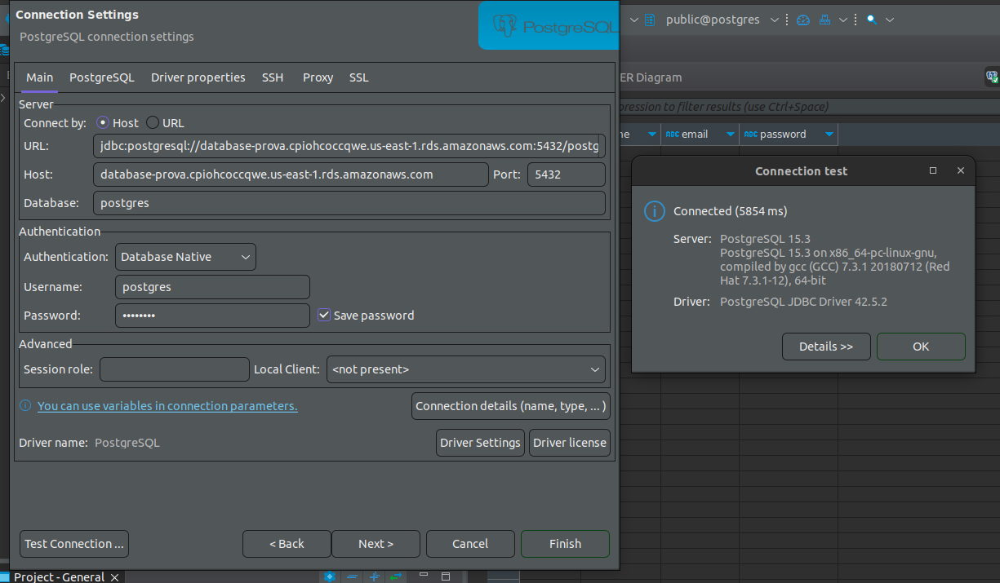

## Comandos dentro da Instância Frontend 

Comandos para alocar os arquivos para rodar o frontend utilizando Apache\

```bash

sudo apt update
sudo apt upgrade -y
sudo apt install apache2 -y

git clone https://github.com/HallZero/prova-2023-09-29.git

sudo cp ./prova-2023-09-29/frontend /var/www/html

cd /var/www/html

sudo mv ./frontend/index.html /var/www/html
sudo mv ./frontend/script.js /var/www/html
sudo mv ./frontend/styles.css /var/www/html

sudo rmdir frontend
```

## Comandos dentro da Instância Backend

```bash
sudo apt update
sudo apt upgrade -y

git clone https://github.com/HallZero/prova-2023-09-29.git

sudo apt install python3-pip

cd prova-2023-09-29/backend

python3 criar_banco.py

python3 main.py
```

# Alteração no arquivo script.js

Configurei um IP elástico para a instância de EC2 do backend para poder fazer requisições a partir do frontend

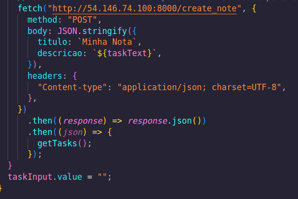